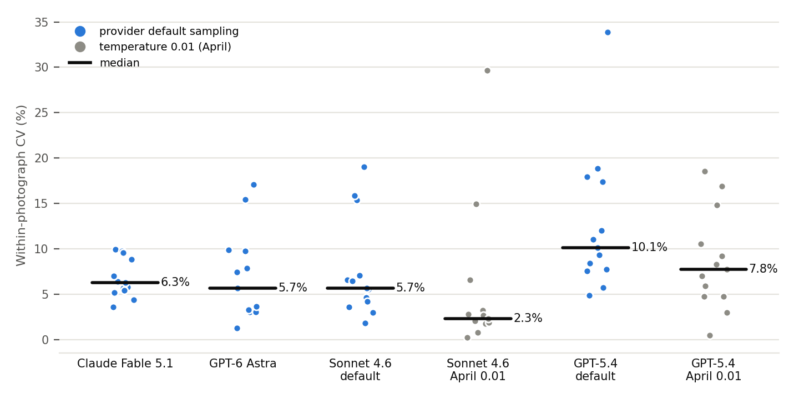
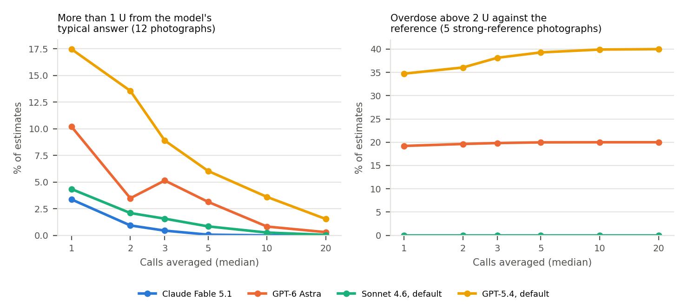
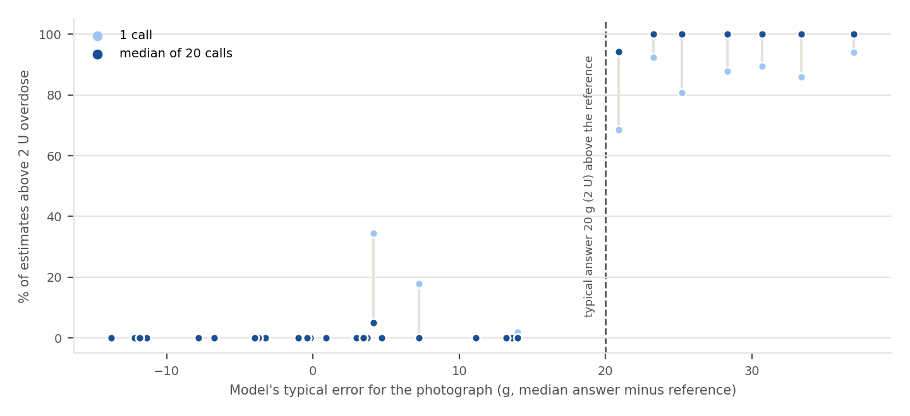

# Carbohydrate estimates from food photographs by Claude Fable 5.1 and GPT-6 Astra: a September 2026 update to a reproducibility benchmark

*Averaging repeated calls removes outlying estimates and leaves systematic error in place*

Tim Street  
Diabettech, United Kingdom. https://www.diabettech.com

Preprint. Originally published on github.com/tim2000s/llm-food-benchmark-2026-09 on 21 September 2026 (data collection and analysis). Source: <https://github.com/tim2000s/llm-food-benchmark-2026-09>. This version: v1, September 2026. Licence: Creative Commons Attribution 4.0 International (CC BY 4.0).

## Abstract

In April 2026 a benchmark sent 13 food photographs about 500 times each to four vision-capable large language models (LLMs) at temperature 0.01 and reported median within-photograph coefficients of variation (CV) of 2.4% to 11.0%. Two newer models, Claude Fable 5.1 and GPT-6 Astra, accept no sampling parameter and cannot run without reasoning, so that condition can no longer be reproduced. This update sent the same photographs and prompt 50 times each to the two new models and to Claude Sonnet 4.6 and GPT-5.4 at provider-default sampling. An application can respond to the lost control by sending a photograph several times and taking the median answer. Simulated from the calls already made, the median of 20 calls cut the share of estimates more than 1 U (10 g) from the model's own typical answer from between 3.4% and 17.5% to 1.5% or less. On the five photographs with packet-label or weighed references it removed every estimate implying an insulin overdose above 5 U, but did not reduce the share implying an overdose above 2 U: 19.2% with one call and 20.0% with 20 for Astra, and 34.7% and 40.0% for GPT-5.4. Each photograph's rate moved towards 0% if the model's typical answer was within 20 g of the reference and towards 100% if it was not, so averaging removed outlying estimates and left systematic error in place. Compared across all ten 50-call blocks of the April runs, default sampling raised the median CV of Sonnet 4.6 from 2.3% (95% CI 1.8 to 3.2) to 5.7% (4.2 to 7.1) and of GPT-5.4 from 7.8% (4.8 to 10.6) to 10.1% (7.8 to 17.4); Fable 5.1 and Astra had 6.3% (5.4 to 8.9) and 5.7% (3.3 to 9.8). Astra returned unparseable output in 40 of 50 calls on one photograph and in 1% elsewhere. Five strong-reference photographs did not resolve differences in accuracy between models; detecting a 5 g difference would need between 13 and 57 photographs depending on the pair. Overdose rates depend on the insulin-to-carbohydrate ratio assumed, and at 1 U per 5 g every model exceeded 2 U in at least 15% of estimates.

Keywords: artificial intelligence, carbohydrate counting, large language models, reproducibility, food recognition, insulin dosing, type 1 diabetes, automated insulin delivery

## 1. Why an update

The April 2026 preprint [1] asked how much a vision-capable LLM disagrees with itself when shown the same food photograph repeatedly, and how that disagreement relates to accuracy. Thirteen photographs were each sent between 495 and 561 times to GPT-5.4, Claude Sonnet 4.6, Gemini 2.5 Pro and Gemini 3.1 Pro Preview, using a food-analysis prompt adapted from the iAPS automated insulin delivery system [2], at temperature 0.01. The median within-photograph CV ranged from 2.4% for Sonnet 4.6 to 11.0% for Gemini 2.5 Pro. On the five photographs with the strongest reference values, Sonnet 4.6 had the lowest mean absolute error (MAE, 8.7 g) and none of its estimates implied an insulin overdose above 2 U.

Two things have changed since. Both providers have released new flagship models, Claude Fable 5.1 from Anthropic and GPT-6 Astra from OpenAI. Neither accepts `temperature` or `top_p`: Fable 5.1 rejects them with an error [3], and OpenAI's migration guide for Astra says to remove them [4]. Neither can be run without reasoning. The condition the April study held fixed is therefore no longer available on current models, and any application using them samples at whatever the provider does by default.

The April preprint anticipated both halves of this. Its limitations noted that deployments at higher temperatures "would experience greater variation still", and its recommendations proposed sending each photograph three to five times and presenting the median. This update measures the first and tests the second, extending the test to 20 calls.

## 2. Methods

### 2.1 Arms

Four arms were run on 21 September 2026 (Table 1). The two new models ran at the lowest reasoning effort each allows (`low`), matched between them; this is a modelling choice, made because it is the setting closest to deterministic that remains. The two April models were rerun with the temperature setting removed and everything else as in April, so that the only change for them is sampling. Sonnet 4.6 ran without extended thinking, as in April, and GPT-5.4 at its default reasoning setting, which used no reasoning tokens in either run.

Table 1. Arms of the September 2026 run.

| Arm | Model | Sampling | Reasoning | Image long edge | Calls per photograph |
|---|---|---|---|---|---|
| Fable 5.1 | claude-fable-5-1 | provider default | effort low (thinking always on) | 1,568 px | 50 |
| Astra | gpt-6-astra | provider default | effort low | 2,048 px | 50 |
| Sonnet 4.6, default | claude-sonnet-4-6 | provider default | none | 1,568 px | 50 |
| GPT-5.4, default | gpt-5.4 | provider default | provider default | 2,048 px | 50 |

The prompt and image preprocessing (per-provider maximum dimension, JPEG quality 85) were those of April, and the SHA-256 of the prompt recorded in every results file matches the April hash. The response parser was April's apart from the corrections in section 2.5. Each call was an independent request through the provider's batch API. Gemini models were not rerun.

### 2.2 Comparison with April

The April runs made about 500 calls per photograph and this run made 50. A within-photograph range grows with the number of calls, and the 5th to 95th percentile width does so to a lesser degree, so figures from 500 calls are not comparable with figures from 50. The April runs were therefore divided into their ten complete blocks of 50 calls per photograph (calls 1 to 50, 51 to 100, and so on to 500), each measure was computed within every block, and the April comparator is the median over the ten blocks. For the per-photograph CV used in paired tests, each photograph's April CV is the median of its ten block CVs.

This matters for GPT-5.4. Its median CV varies between blocks from 4.3% to 9.1%, against 8.4% over all calls pooled, because the April GPT-5.4 data were collected as many separately submitted sub-batches and part of the published spread comes from differences between them. For Sonnet 4.6 the block medians lie between 1.9% and 2.9%. The first 50 calls happen to form GPT-5.4's least variable block, and comparing against them alone would overstate the effect of default sampling; that comparison is reported as secondary. Accuracy for the April arms is computed on their first 50 calls, which reproduce the published values closely (MAE on the strong-reference photographs of 8.8 g for Sonnet 4.6 and 17.3 g for GPT-5.4, against 8.7 g and 17.4 g published).

### 2.3 Measures

Total carbohydrate, CV, range, interquartile range, 5th to 95th percentile width, reference tiers and overdose thresholds follow the April definitions [1]. Intervals are 95% bootstrap intervals over photographs (5,000 resamples), because the photograph is the unit a reader would generalise over; April quoted per-query t intervals, which treat 500 calls about one photograph as 500 independent observations and are much narrower. Paired comparisons of per-photograph CV use the Wilcoxon signed-rank test.

Accuracy is reported primarily on the five photographs whose references come from a packet label or weighing. The set of all nine reference photographs adds three portioned references and one visual estimate (the churros, 80 g), and is reported as exploratory.

Insulin figures convert grams at 1 U per 10 g, as April did. That ratio is an illustration, not a property of any person; ratios vary several-fold between people. The overdose rates are therefore also reported at 1 U per 5 g and 1 U per 20 g, at which a 2 U overdose corresponds to 10 g and 40 g above the reference.

The number of photographs needed to rank two models by accuracy was estimated from the spread of their paired per-photograph MAE differences, for 80% power at a two-sided 5% level (normal approximation).

### 2.4 Averaging

The averaging analysis made no new calls. For each photograph, arm and number of calls k (1, 2, 3, 5, 10 and 20), 10,000 batches of k answers were drawn with replacement from that arm's answers for the photograph and the median of each batch taken; the same random draws were applied to every arm (seed 20260922). Drawing with replacement treats a photograph's answers as the model's distribution for it. Drawing 20 of 50 without replacement would make simulated batches share most of their answers and understate the spread of 20 fresh calls by about a fifth. Drawing without replacement, and the mean in place of the median, were run as sensitivity analyses. Rates are means over photographs, each photograph weighted equally.

Two kinds of risk are distinguished because they respond to averaging differently. Variability risk is the chance that an estimate lands more than 10 g (1 U) from the model's own typical answer for the photograph, the median of all its answers; it needs no reference. Accuracy risk is the chance that an estimate implies an overdose above 2 U against the reference.

### 2.5 Changes to the benchmark code

Three faults in the April code would have affected the new models and were corrected before or during the run. None changes any April result.

- The Anthropic reader took the first content block as the answer. On a model that always thinks, the first block is the thinking block, so every Fable 5.1 answer would have been lost. The answer is now the concatenation of the text blocks.
- When a response was malformed JSON, the April extractor could fall back to a nested object (a single food item) and record a successful answer with no food items, which scores as 0 g. A response without a top-level list of food items is now a parse failure. This occurred in 2 Fable 5.1 responses; none of the 26,909 April answers had the pattern.
- Requests rejected by OpenAI at validation appear only in a batch's error file, which the April runner did not read. It now does.

Both provider accounts ran out of credit during the run. The 190 requests affected were resubmitted and every photograph-and-call slot was settled once. The code and the raw responses are public [5], and section 3.6 gives the cost.

### 2.6 Independence of the analysis

The benchmark code, the analysis and the drafting of this paper were done with Claude Code, an Anthropic product, and Anthropic makes Fable 5.1 and Sonnet 4.6. The design limits what that relationship could influence in three ways. The prompt is April's, adapted from the iAPS codebase before this work began, and its hash is unchanged. Everything that turns a response into a number (JSON extraction, the total carbohydrate calculation and every measure) is the same code for every model and does not know which model produced the response; the provider-specific code only submits requests and reads the text back. The one provider-specific correction, the Anthropic text-block reader, restores answers that would otherwise have been lost and does not alter any answer that was read. The code, every raw response and the scripts behind each table are public [5], so each figure can be regenerated and checked. The analysis was not pre-registered and has not been independently audited.

## 3. Results

### 3.1 Completion

Sonnet 4.6 and GPT-5.4 answered all 650 calls. Fable 5.1 answered 648; the other two were the malformed responses described above, both on the stuffed pork loin. Astra answered 604 (92.9%). All 46 of its failures had the same cause: a numeric field in the JSON was written as a word, always after a doubled space. On the churros photograph it wrote the carbohydrate content per 100 g as `forty` or `Forty` in 39 of 50 calls and as `progressively55.0` once. The six failures on three other photographs were similar (`fifty`, and in three cases unrelated words such as `skinless`).

The failures were concentrated on one meal. On the other 12 photographs Astra failed in 1.0% of calls and Fable 5.1 in 0.3%, and a single retry would recover almost all of them. On the churros Astra failed in 80% of calls: an application would need five attempts on average to obtain an answer, and three attempts in a row would all fail 51% of the time. Astra therefore has 10 answers for the churros, and measures that include that photograph rest on those 10.

### 3.2 Reproducibility

Default sampling increased the spread of both April models (Table 2, Figure 1). Against the April runs taken over all ten blocks, the median CV of Sonnet 4.6 rose from 2.3% to 5.7%, higher on 11 of 13 photographs (median difference 2.1 percentage points, p = 0.027), and that of GPT-5.4 from 7.8% to 10.1%, higher on 12 of 13 (median difference 3.1 points, p = 0.001). Against each April block separately, default sampling gave the higher CV on 10 to 13 photographs for GPT-5.4 (p from 0.0002 to 0.027) and on 10 to 12 for Sonnet 4.6 (p from 0.017 to 0.057). Against the first 50 April calls alone, GPT-5.4's rise appears as 4.3% to 10.1%, which overstates it for the reason given in section 2.2.

Table 2. Reproducibility at 50 calls per photograph. The April columns are medians over the ten 50-call blocks of the April runs; CV and width medians take each photograph's median over blocks. Intervals are 95% bootstrap intervals over the 13 photographs.

| Measure | Fable 5.1 | Astra | Sonnet 4.6, default | Sonnet 4.6, April 0.01 | GPT-5.4, default | GPT-5.4, April 0.01 |
|---|---|---|---|---|---|---|
| Answers | 648 of 650 | 604 of 650 | 650 of 650 | 650 per block | 650 of 650 | 650 per block |
| CV, median | 6.3% (5.4–8.9) | 5.7% (3.3–9.8) | 5.7% (4.2–7.1) | 2.3% (1.8–3.2) | 10.1% (7.8–17.4) | 7.8% (4.8–10.6) |
| CV, maximum | 10.0% | 17.1% | 19.0% | 29.7% | 33.9% | 22.5% |
| P5–P95 width, median (g) | 11.9 (7.2–14.9) | 11.6 (8.2–20.0) | 7.1 (4.5–13.5) | 3.8 (2.0–6.8) | 19.1 (13.9–33.1) | 12.9 (8.3–21.3) |
| Range, median (g) | 16.8 | 17.0 | 12.1 | 7.3 | 29.6 | 18.4 |
| Insulin range, median (U) | 1.7 | 1.7 | 1.2 | 0.7 | 3.0 | 1.8 |
| Photographs with range > 2 U | 5 | 6 | 4 | 2 | 10 | 5 |
| Photographs with range > 5 U | 0 | 0 | 1 | 1 | 3 | 2 |

Figure 1. Within-photograph CV of the carbohydrate estimate for each of the 13 photographs, by arm. Blue points are provider-default sampling at 50 calls per photograph; grey points are the April runs at temperature 0.01, each the median over the photograph's ten 50-call blocks. The black bar is the median.

The two new models were close to Sonnet 4.6 at default sampling. Their median CVs, 6.3% for Fable 5.1 and 5.7% for Astra, were indistinguishable from each other (p = 0.95). Fable 5.1 did not differ detectably from Sonnet 4.6 at default sampling (p = 0.79). Astra's CV was lower than GPT-5.4 at default sampling on 10 of 13 photographs (median difference 4.7 points, p = 0.003). Fable 5.1 had the lowest maximum CV of any arm (10.0%), and neither new model had a photograph with a range above 5 U.

### 3.3 Accuracy and insulin translation

Table 3. Accuracy against the five strong-reference photographs (packet label or weighed), the primary set, and against all nine reference photographs, exploratory. MAE intervals are 95% bootstrap intervals over photographs. Insulin figures use 1 U per 10 g; Table 4 gives other ratios.

| Measure | Fable 5.1 | Astra | Sonnet 4.6, default | Sonnet 4.6, April 0.01 | GPT-5.4, default | GPT-5.4, April 0.01 |
|---|---|---|---|---|---|---|
| Strong: MAE (g) | 7.0 (3.6–10.3) | 13.2 (4.7–25.7) | 8.8 (5.9–11.6) | 8.8 (4.8–12.0) | 14.7 (4.2–25.4) | 17.3 (7.0–28.1) |
| Strong: mean bias (g) | +0.3 | +8.8 | −0.6 | −1.1 | +9.9 | +11.5 |
| Strong: within 20 g | 100% | 80.7% | 100% | 100% | 65.2% | 61.6% |
| Strong: > 2 U overdose | 0.0% | 19.3% | 0.0% | 0.0% | 34.8% | 38.4% |
| Strong: > 5 U overdose | 0.0% | 2.0% | 0.0% | 0.0% | 0.4% | 0.0% |
| Strong: worst overdose (U) | 1.7 | 5.9 | 1.6 | 1.2 | 5.9 | 4.3 |
| All nine (exploratory): MAE (g) | 8.9 (5.9–11.8) | 15.1 (7.5–22.4) | 10.7 (7.2–14.6) | 11.4 (7.3–16.2) | 16.6 (8.9–24.0) | 20.4 (12.6–28.3) |
| All nine (exploratory): mean bias (g) | −1.5 | +10.6 | +1.6 | +1.8 | +7.8 | +12.7 |

Astra and GPT-5.4 overestimated the strong-reference photographs, with mean biases of +8.8 g and +9.9 g, and 19.3% and 34.8% of their estimates implied an overdose above 2 U. Fable 5.1 and Sonnet 4.6 had biases within 1 g of zero and no such estimate.

These differences between models are not established by the data. Compared photograph by photograph over the nine reference photographs, Fable 5.1's MAE was lower than Sonnet 4.6's at default sampling by a mean of 1.8 g (95% CI −5.3 to +2.2), and lower than Astra's by 5.5 g (−13.1 to +1.6); Astra against GPT-5.4 at default sampling was −2.2 g (−10.6 to +5.7). Every interval includes zero. From the spread of these paired differences, detecting a 5 g difference in MAE with 80% power would need 13 photographs for Fable 5.1 against Sonnet 4.6, 46 for Fable 5.1 against Astra and 57 for Astra against GPT-5.4. Detecting the 1.8 g difference observed between Fable 5.1 and Sonnet 4.6 would need about 94.

Default sampling did not make either April model less accurate. The MAE of Sonnet 4.6 changed by −0.7 g (−1.6 to +0.2) and that of GPT-5.4 by −3.7 g (−9.2 to +0.3).

Table 4. Share of estimates implying an overdose above 2 U on the five strong-reference photographs, at three insulin-to-carbohydrate ratios, for one call and for the median of 20 calls. Rates are from the simulation of section 2.4 and differ from the observed rates in Table 3 by up to 0.1 percentage point.

| Arm | 1 U/5 g, 1 call | 20 calls | 1 U/10 g, 1 call | 20 calls | 1 U/20 g, 1 call | 20 calls |
|---|---|---|---|---|---|---|
| Fable 5.1 | 16.0% | 19.4% | 0.0% | 0.0% | 0.0% | 0.0% |
| Astra | 35.9% | 40.0% | 19.2% | 20.0% | 8.4% | 5.0% |
| Sonnet 4.6, default | 15.2% | 16.6% | 0.0% | 0.0% | 0.0% | 0.0% |
| GPT-5.4, default | 37.6% | 40.0% | 34.8% | 40.0% | 3.2% | 0.0% |

The overdose rates depend on the ratio (Table 4). For a person who takes 1 U per 5 g, a 10 g overestimate is a 2 U overdose, and every model exceeded that in at least 15% of single estimates, including Fable 5.1 and Sonnet 4.6, whose rate at 1 U per 10 g was zero. For a person who takes 1 U per 20 g, only Astra retained a material rate.

### 3.4 Averaging up to 20 calls

Table 5. Averaging and variability over the 12 photographs other than the churros, where Astra has too few answers to resample. Width is the 5th to 95th percentile of the estimate in grams, median over photographs. "More than 1 U off" is the share of estimates more than 10 g from the model's typical answer, mean over photographs. 95% bootstrap intervals over photographs.

| Arm | Width, 1 call | Width, 5 calls | Width, 20 calls | More than 1 U off, 1 call | 5 calls | 20 calls |
|---|---|---|---|---|---|---|
| Fable 5.1 | 11.7 (6.7–15.4) | 5.1 (2.6–8.0) | 3.2 (2.1–4.5) | 3.4% (1.5–5.8) | 0.1% (0.0–0.2) | 0.0% (0.0–0.0) |
| Astra | 10.9 (7.3–19.6) | 7.0 (4.4–12.4) | 3.4 (2.1–5.1) | 10.2% (2.7–19.3) | 3.1% (0.3–7.2) | 0.3% (0.0–0.9) |
| Sonnet 4.6, default | 8.5 (3.9–15.6) | 5.1 (3.4–9.0) | 2.9 (1.7–5.3) | 4.3% (0.7–9.9) | 0.8% (0.0–2.4) | 0.0% (0.0–0.1) |
| GPT-5.4, default | 19.8 (14.8–36.3) | 9.6 (7.7–18.8) | 4.9 (2.9–10.1) | 17.5% (8.6–27.3) | 6.0% (0.9–12.2) | 1.5% (0.0–3.7) |

Averaging removed variability risk (Table 5, Figure 2). With 20 calls the share of estimates more than 1 U from the model's typical answer was 0.3% or less in every arm except GPT-5.4, where it was 1.5%, and five calls achieved most of the reduction for Fable 5.1 and Sonnet 4.6. Against the April baselines, five default-sampling calls brought GPT-5.4's width below that of one April call (9.6 g against 12.9 g), while Sonnet 4.6 needed more than five (5.1 g against 3.8 g) and was below it at 20 (2.9 g).

Table 6. Averaging and accuracy risk: share of estimates implying an overdose above 2 U at 1 U per 10 g, mean over photographs, with 95% bootstrap intervals. The last column counts, of the eight reference photographs other than the churros, those on which 20 calls raised or lowered the rate relative to one call. Single-call rates are simulated and differ from Table 3 by up to 0.1 percentage point.

| Arm | Strong reference, 1 call | 5 calls | 20 calls | All 8 references, 1 call | 20 calls | Raised / lowered |
|---|---|---|---|---|---|---|
| Fable 5.1 | 0.0% | 0.0% | 0.0% | 0.0% | 0.0% | 0 / 0 |
| Astra | 19.2% (0.0–56.8) | 20.0% | 20.0% (0.0–60.0) | 33.6% (9.9–66.8) | 37.5% (12.5–75.0) | 3 / 1 |
| Sonnet 4.6, default | 0.0% | 0.0% | 0.0% | 10.8% (0.0–27.9) | 11.8% (0.0–35.3) | 1 / 1 |
| GPT-5.4, default | 34.7% (0.0–69.8) | 39.3% | 40.0% (0.0–80.0) | 37.2% (10.7–65.8) | 38.1% (12.5–75.0) | 3 / 1 |

Figure 2. Effect of averaging on the two kinds of risk. Left: share of estimates more than 1 U from the model's typical answer, over the 12 photographs other than the churros. Right: share of estimates implying an overdose above 2 U, over the five strong-reference photographs; Fable 5.1 and Sonnet 4.6 lie together at zero. The horizontal axis is the number of calls whose median is taken, on a logarithmic scale.

Averaging did not reduce accuracy risk (Table 6). The changes in the pooled rates are small against their intervals, and the mechanism is clearer photograph by photograph (Figure 3). As calls are added the estimate converges on the model's typical answer for the photograph, so the overdose rate for that photograph converges on 0% if the typical answer is less than 20 g above the reference and on 100% if it is more. Where a model's single calls overdosed a photograph most of the time, 20 calls made it nearly every time. Astra's typical answer for the breakfast burrito was 37 g above the reference, and its overdose rate went from 94.0% to 100%; for the chilli, 25 g above, from 80.7% to 99.9%. Sonnet 4.6 at default sampling was 21 g above on the chilli and went from 68.4% to 94.2%. Where the typical answer was close and the overdoses came from scatter, averaging removed them: GPT-5.4 at default sampling on the stuffed pork loin, 4 g above, went from 34.5% to 5.0%, and Sonnet 4.6 at default sampling on the roast dinner, 7 g above, from 17.8% to 0%.

Figure 3. Each point is one model on one of the eight reference photographs other than the churros, placed by the model's typical error for that photograph (its median answer minus the reference). Light points give the share of single calls implying an overdose above 2 U, dark points the share for the median of 20 calls. Fable 5.1, Astra, Sonnet 4.6 and GPT-5.4 at default sampling are shown.

The largest overdoses did disappear. Astra's estimates implying more than 5 U fell from 2.1% of strong-reference estimates to 0% by ten calls, and GPT-5.4's from 0.4% to 0% by five. The mean absolute error barely moved: on the strong-reference photographs, Fable 5.1 went from 7.0 g to 6.1 g, Astra from 13.2 g to 12.5 g, and GPT-5.4 stayed at 14.7 g. The same convergence operates below the reference. GPT-5.4 put the churros, whose 80 g reference is a visual estimate, more than 20 g low in 73.9% of single calls and in 99.3% of 20-call medians. At other insulin-to-carbohydrate ratios the pattern holds (Table 4): at 1 U per 5 g, 20 calls raised Fable 5.1's rate from 16.0% to 19.4%, and at 1 U per 20 g they lowered Astra's from 8.4% to 5.0%, each according to where the typical answers lay relative to the threshold.

The median was the better statistic. With the mean, rare outlying answers pulled the estimate away from the typical answer as calls were added; for Sonnet 4.6 at temperature 0.01 the share more than 1 U off rose from 4.2% with one call to 5.2% with 20. Drawing without replacement gave the same conclusions. The median of two calls is their mean, which is why some arms are slightly more variable at three calls than at two.

### 3.5 Identification

The April preprint documented systematic misidentifications. Table 7 repeats those checks as the percentage of answers naming each item, with the difference in mean estimated carbohydrate between answers that name the item and answers that do not, where both occur.

Table 7. Identification on the photographs the April preprint discussed. Figures in brackets are the difference in mean carbohydrate estimate (g) between answers naming the item and the rest.

| Photograph and item named | Fable 5.1 | Astra | Sonnet 4.6, default | Sonnet 4.6, April 0.01 | GPT-5.4, default | GPT-5.4, April 0.01 |
|---|---|---|---|---|---|---|
| Bakewell tart: "Bakewell" | 100% | 73% (−1.4) | 0% | 0% | 0% | 0% |
| Bakewell tart: "Linzer" | 0% | 0% | 100% | 100% | 0% | 0% |
| Crema catalana: "crema catalana" | 76% (+0.6) | 100% | 0% | 0% | 0% | 0% |
| Stuffed pork loin: "pork" | 54% (−0.4) | 58% (−8.9) | 100% | 100% | 0% | 0% |
| Stuffed pork loin: "chicken" | 46% (+0.4) | 0% | 2% (+0.9) | 26% (−0.6) | 100% | 100% |
| Pizza: "burrata" from the adjacent plate | 0% | 96% (+2.8) | 0% | 18% (+5.6) | 34% (+4.4) | 0% |

Both new models named the Bakewell tart and the crema catalana, which no April model other than Gemini 3.1 Pro did. Fable 5.1 named chicken in 46% of answers on the stuffed pork loin, and Astra included the burrata salad from the neighbouring plate in the pizza photograph in 96%. In this set, misidentification moved the carbohydrate estimate little: the meat in the pork loin carries almost no carbohydrate, and the burrata salad added 3 g to 6 g where it was counted. The exception was Astra on the pork loin, whose answers that named pork were 8.9 g lower than those that did not. The identification errors checked here explain little of the accuracy differences in Table 3.

### 3.6 Tokens and cost

Table 8. Mean tokens per answered call and cost at batch prices (September 2026), with the annual cost in US dollars for one person logging three meals a day.

| Arm | Input tokens | Output tokens | Of which reasoning | USD per 1,000 answers | Per year, 1 call | Per year, 20 calls |
|---|---|---|---|---|---|---|
| Fable 5.1 | 4,918 | 1,434 | not reported separately | 60.63 | 66 | 1,328 |
| Astra | 5,291 | 1,258 | 37 | 62.38 | 68 | 1,366 |
| Sonnet 4.6, default | 3,371 | 1,703 | none | 17.83 | 20 | 390 |
| GPT-5.4, default | 4,502 | 818 | 0 | 11.76 | 13 | 258 |

At low effort both new models reasoned little: Astra averaged 37 reasoning tokens, and Fable 5.1's output, which includes its thinking, was shorter than Sonnet 4.6's. Per answer, the two new models cost 3.4 to 5.3 times as much as the two April models. At batch prices, 20-call averaging with either new model costs about 1,300 US dollars a year for three meals a day, and an application that needs the answer immediately pays real-time prices, twice as much. The run itself cost 96.20 US dollars.

## 4. Discussion

Averaging repeated calls, the mitigation the April preprint proposed, deals with one of the two risks that preprint described and not the other. The acute risk, a single outlying estimate, falls quickly: five calls remove most of it for Fable 5.1 and Sonnet 4.6, twenty for every arm, and estimates implying overdoses above 5 U disappear. The chronic risk, a model that overestimates a meal, does not fall and can rise. With one call, a model whose typical answer for a meal is 25 g too high overdoses most of the time and occasionally does not; with twenty, it overdoses on nearly every attempt, and the number the person sees is close to the same each time. Consistency of that kind is easily taken for correctness. An application that averages calls therefore needs the confirmation step as much as one that does not, and it pays about twenty times as much for each answer.

At the sampling applications now receive by default, both April models became more variable, Sonnet 4.6 from 2.3% to 5.7% and GPT-5.4 from 7.8% to 10.1%, and the two new models sit close to Sonnet 4.6 at default sampling. The April figure of 2.4% for Sonnet 4.6 describes a configuration a developer can still choose for that model, but not for its successor. The block analysis adds a caution about the April data themselves: GPT-5.4's spread differed between separately submitted batches, so reproducibility measured in one session can understate what a user meets across sessions.

Accuracy did not separate the models reliably. Fable 5.1 and Sonnet 4.6 were unbiased on the strong-reference photographs and Astra and GPT-5.4 overestimated them, but no paired comparison of MAE was resolved, and a ranking would need a test set of weighed references several times larger than the five photographs that carry the primary analysis here. The overdose rates also rest on the ratio used to convert grams to units. At 1 U per 5 g every model produced a 2 U overdose in at least 15% of estimates, so an estimate that is harmless for one person is not harmless for another.

Astra's parse failures are a separate safety property. Across most meals they were rare and a retry would recover them, but on one photograph Astra failed four times in five, so for that meal an application would usually have no answer at all. A carbohydrate value written as a word is caught by a strict parser and becomes no answer; a lenient parser that coerced or skipped the field would produce a wrong one. The benchmark's April parser had a comparable weakness for malformed JSON, now corrected. Applications should reject any response that fails strict validation instead of repairing it, and should tell the person when a photograph has not produced an answer.

### Limitations

Each arm made 50 calls per photograph on one day, and the April block analysis shows that a single session can understate variation that appears across sessions. Thirteen photographs, five with strong references, give wide intervals, and no accuracy ranking between arms is supported. One reference is a visual estimate. Insulin figures depend on an illustrative ratio, and Table 4 shows how much. Reasoning effort was fixed at the lowest level, and higher settings may change both spread and accuracy. Image sizes differ by provider as they did in April. Only the Anthropic and OpenAI models were run, and the prompt was not varied. Fable 5.1 does not report its thinking tokens separately, so its reasoning cost is not isolated. The averaging analysis resamples the 50 calls made per photograph and assumes an application's repeated calls behave like independent draws from the same distribution, which cannot represent variation between sessions. The analysis was not pre-registered, and although the code and data are public it has not been audited by anyone independent of the tools used to write it (section 2.6).

## 5. Conclusions

Taking the median of up to 20 calls removed nearly all carbohydrate estimates more than 1 U from a model's typical answer, and every strong-reference estimate implying an overdose above 5 U, but did not reduce the rate of 2 U overdoses: on photographs a model systematically overestimated, that rate rose towards 100%. Averaging is worth using against outlying answers and cannot substitute for confirmation by the person. Without a fixed low temperature, Sonnet 4.6 and GPT-5.4 became more variable, and Claude Fable 5.1 and GPT-6 Astra, which cannot be run at a fixed temperature, had median CVs of 6.3% and 5.7%. Astra failed to produce any answer for one photograph in four calls out of five. Differences in accuracy between models were not resolved by this test set. Neither new model is a basis for insulin dosing without confirmation by the person using it.

## Data availability

Raw responses, results, analysis code and the scripts that produced every table and figure are public in the repository for this update [5]. The April data and code are in the companion repository of the original preprint [6]. The reproducibility and accuracy tables are regenerated by `update_analysis.py` and `review_analyses.py`, and the averaging tables and figures by `averaging_risk.py`.

## Funding, relationships and acknowledgements

This work received no specific funding; API costs were paid by the author. The author has used open-source automated insulin delivery since 2016, has contributed to AID systems in the oref family and maintains a fork of AndroidAPS; the author has no affiliation with the iAPS project. Claude Code (Anthropic) was used for the benchmark code, the analysis and drafting; the author reviewed the analysis and is responsible for the conclusions. Anthropic makes two of the models evaluated, and section 2.6 describes how the design limits the influence of that relationship. The manuscript was revised after a critical review, which led to the ten-block April comparison, the strong-reference primary analysis, the ratio sensitivity, the failure and identification analyses, and section 2.6.

## References

1. Street T (2026) Reproducibility and accuracy of large language model vision APIs for carbohydrate estimation from food photographs: a four-model batch comparison with implications for automated insulin dosing. SSRN preprint. https://doi.org/10.2139/ssrn.6577780. Also published at https://www.diabettech.com/i-asked-ai-to-count-my-carbs-27000-times-it-couldnt-give-me-the-same-answer-twice/
2. iAPS Project (2026) iAPS: open-source automated insulin delivery system. https://github.com/Artificial-Pancreas/iAPS
3. Anthropic (2026) Migrating to Claude Fable 5.1: sampling parameters and thinking. Claude API documentation. https://docs.claude.com
4. OpenAI (2026) GPT-6 Astra model guide. https://developers.openai.com/api/docs/guides/latest-model?model=gpt-6-astra
5. Street T (2026) llm-food-benchmark-2026-09: September 2026 rerun. https://github.com/tim2000s/llm-food-benchmark-2026-09
6. Street T (2026) llm-food-benchmark-academic: companion repository. https://github.com/tim2000s/llm-food-benchmark-academic
